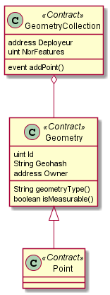

## Table of Contents

- [About](#About)
- [Prerequisites](#Prerequisites)
- [Installation](#installation)
- [Features](#features)
- [License](#license)

---

## About

This project is about saving geohashes (using H3) of geographique points into a blockchain.

The class diagram was made following the OGC (Open Geospatial Consortium) standard.

## 

## Prerequisites

- Nodejs
- Ganache
- MetaMask
- Truffle

---

## Installation

### Clone

- Clone this repo to your local machine using `https://github.com/fvcproductions/SOMEREPO`

### Setup

- Install the package first

```shell
npm install
```

- Then cd to the truffle directory to and deploy to ganache :

```shell
cd src/Truffle
truffle migrate --network=development
```

- To deploy in the ropsten network :

  - Add the mnomonic of your account in the .secret file
  - Modify the "infuraKey" variable in the "truffle-config.js" file with your key
  - Then :

  ```shell
  cd src/Truffle
  npm install fs truffle-hdwallet-provider
  truffle migrate --network=ropsten
  ```

- To lunch the interface modify the "address" variable in the App.js with the smart contract address and then :

```shell
cd ../..
npm start
```

---

## Tests

- Go to the Truffle folder and use :

```shell
npm install chai chai-as-promised
truffle test
```

---

## License

[](http://badges.mit-license.org)

- **[MIT license](http://opensource.org/licenses/mit-license.php)**
- Copyright 2020 ©
